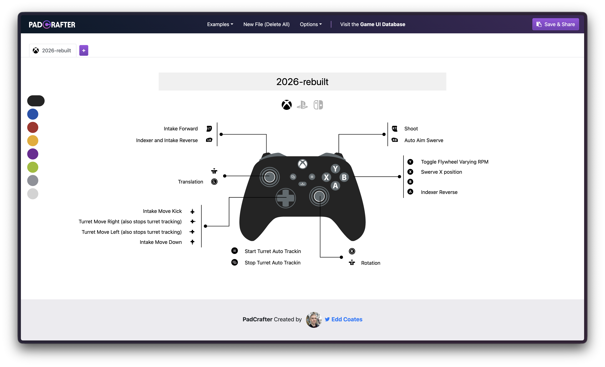

# Controller Bindings

## Drive Controller

### Joysticks
- **Left Stick**: Translation (X/Y movement on field)
- **Right Stick (X-Axis)**: Robot rotation

### Triggers
- **Left Trigger**: Intake
- **Right Trigger**: Shoot

### Bumpers
- **Left Bumper**: *(unbound)*
- **Right Bumper**: Auto drive under trench

### Face Buttons
- **A Button**: Reverse indexer
- **B Button**: Reverse indexer and intake
- **X Button**: Lock swerve wheels
- **Y Button**: Toggle flywheel varying RPM

### D-Pad
- **Up**: Kick intake
- **Right**: Move turret right
- **Left**: Move turret left
- **Down**: Lower intake

### Menu Buttons
- **Start**: Start auto turret tracking
- **Back**: Stop auto turret tracking